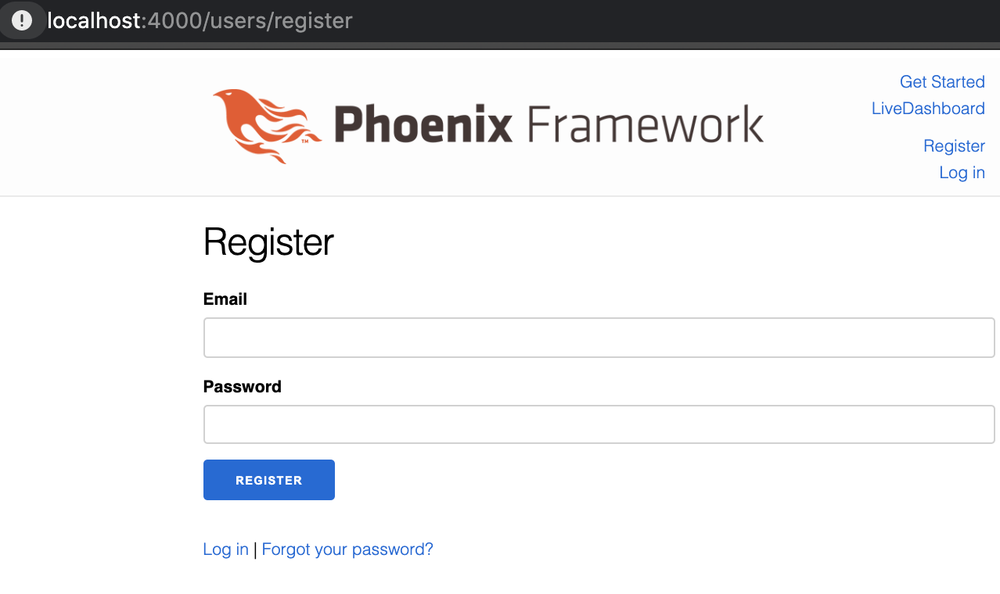
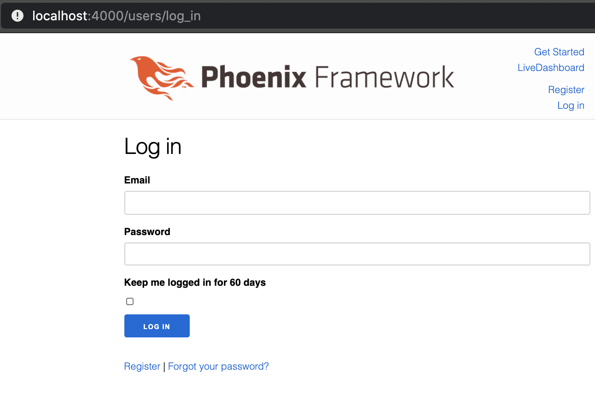
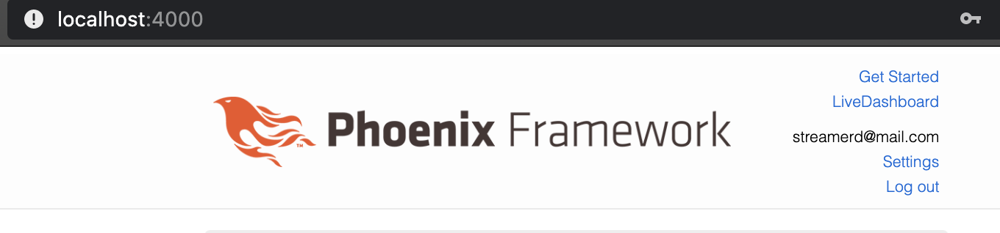
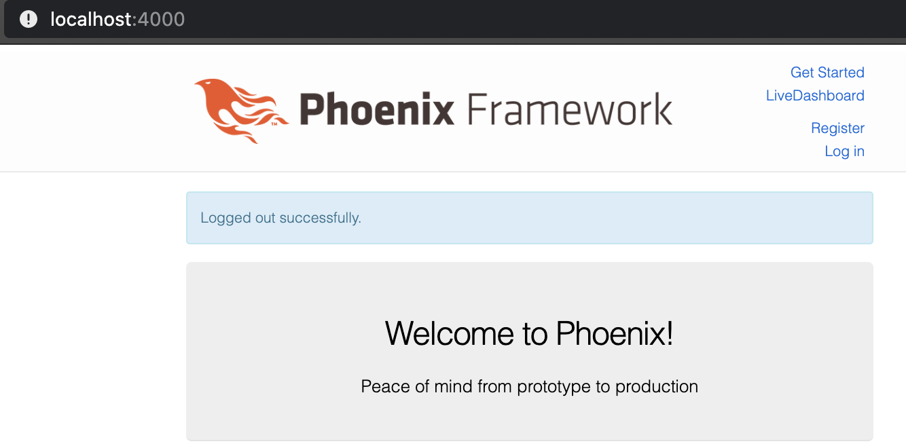

# User Login/Registration included Phoenix Framework App starter with GraphQL, using phx.gen.auth and Absinthe

To start your Phoenix server:

  * Install dependencies with `mix deps.get`
  * Create and migrate your database with `mix ecto.setup`
  * Install Node.js dependencies with `npm install` inside the `assets` directory
  * Start Phoenix endpoint with `mix phx.server`

Now you can visit [`localhost:4000`](http://localhost:4000) from your browser.

API

Example Queries that could be run:
http://localhost:4000/api/graph/graphiql


Register a user (Mutation):
-----------------
```
mutation{
  registerUser (
    input: {
      username: "streamerd", 
      email: "abcd@e.fu",
    	password: "123456789-qwert-y0",
      role: "user",
      behaviours: ["audience", "artist", "volunteer"]
      city: "Hamburg",
      country: "Germany"
    } ){
   id
    username
    country
    city
    behaviours
  }  
}
```

Get all users (Query):
------------------
```
{
  users{
    city
    country
    behaviours
  }
}
```

Registration Form
------------------------------



Login Form
------------------------------




User Logged In
------------------------------




User Logged Out
------------------------------




